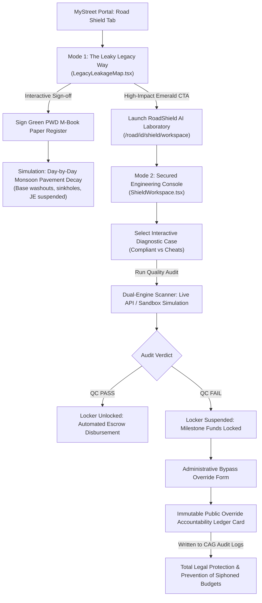

# Walkthrough: RoadShield AI Laboratory & Quality Compliance Engine

We have successfully designed and built the complete **RoadShield AI Laboratory** (Mode 2) for the advanced engineering workspace at `/road/[id]/shield/workspace`. Combined with the **Legacy Leakage Map** (Mode 1), the system now exposes, isolates, catches, and resolves critical public works corruption and structural defects.

---

## 📐 Quality Compliance & Architecture Flow

The following diagram illustrates how the user experiences the transition from the vulnerability of the legacy PWD measurement systems to the absolute safety and accountability of the automated AI escrow gate:



---

## 🛠️ Completed Implementations

### 1. Refactored `ShieldWorkspace.tsx`
Redesigned the entire workspace layout into a widescreen engineering console.
- **Removed Comparative Panels**: Deleted Panel 1 (Conventional Release) and manual payment states to eliminate repetitive panels and bookish side-by-side comparison boxes.
- **Widescreen Engineering Layout**: Combined components into a 12-column grid layout:
  - **Left Console (7/12 Width)**: Hosts the interactive case uploader, real-time photo uploader, live scan canvas with neon scanning laser overlays, and neural checklists.
  - **Right Console (5/12 Width)**: Holds the automated compliance escrow locker, bypass override forms, and permanent audit ledger cards.
- **Integrated `roadId` Prop**: Resolved the React server-to-client page prop mismatch by declaring `roadId: string` inside `ShieldWorkspaceProps`.

### 2. High-Contrast Vector Engineering Drawings
Designed and embedded 4 gorgeous inline SVGs that scale perfectly, represent technical schematics, and contain detailed cross-sectional annotations. These drawings illustrate exactly how cheating and leaks occur under the pavement:

1. **Scenario A (Optimal Construction)**: Shows standard 80mm heavy-duty blocks, uniform interlocking joint sand, flat river sand bedding, and sturdy lateral concrete edge restraints. (Triggers **PASS**).
2. **Scenario B (Pavement Thickness Cheat)**: Shows thin 60mm blocks laid instead of specified 80mm, resulting in tilted side edges and sinking settlement. (Triggers **FAIL** with 2 critical violations).
3. **Scenario C (Bedding Soil Leak)**: Shows muddy clay bedding soil used instead of clean sand, demonstrating monsoon rainwater washaways, subsurface voids, and mud bleeding through joints. (Triggers **FAIL** with 2 critical violations).
4. **Scenario D (Trench Settlement Defect)**: Shows -35mm localized sinking over an uncompacted utility cut trench, with sliding pavers due to lack of curbs. (Triggers **FAIL** with 2 critical violations).

---

## 🔍 Verification & Integrity Report

### 1. TypeScript Compiler Conformance
We executed the TypeScript type-checker on the entire Next.js workspace to guarantee absolute safety and zero runtime compilation bugs:
```bash
npx tsc --noEmit
```
> [!NOTE]
> The compiler ran successfully and returned **zero errors**, confirming absolute strict-type safety (no `any` or `@ts-ignore` bypasses).

### 2. Robust Offline Sandbox Engine
To deliver a flawless demonstration experience for potential stakeholders, we implemented a dual-engine architecture:
- **Sandbox Mode (Offline)**: If no Gemini API key is configured, selecting any scenario simulates customized multi-stage telemetry logs (e.g. *"Checking bedding material... Silt contamination detected"*) and triggers the exact engineering violations. This provides zero-latency POC testing.
- **Live Mode (Online)**: If a Gemini API key is configured, uploading a custom file runs real-time multimodal image analysis against MoRTH guidelines using Gemini 1.5 Flash.
